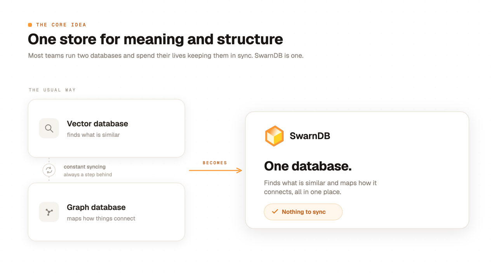
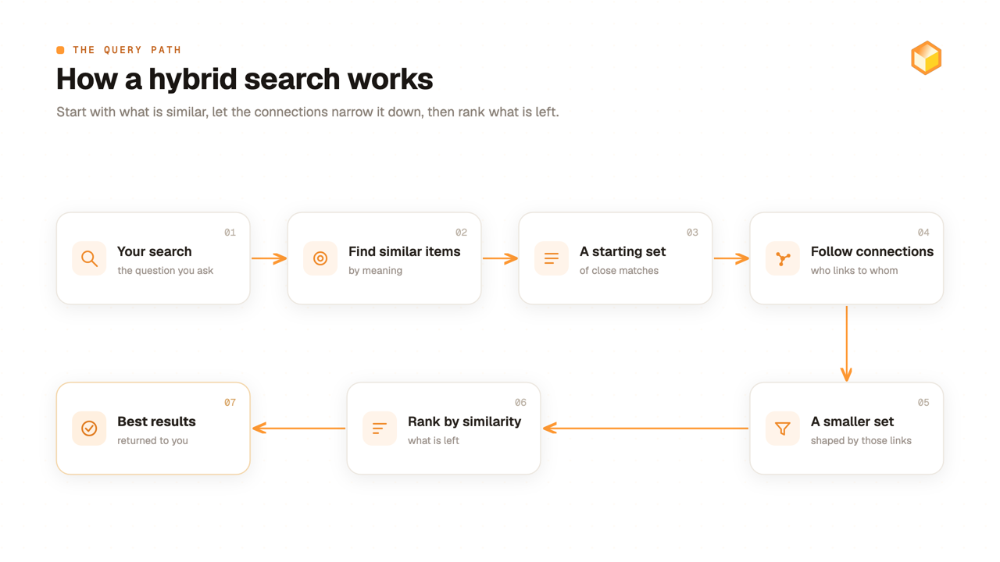
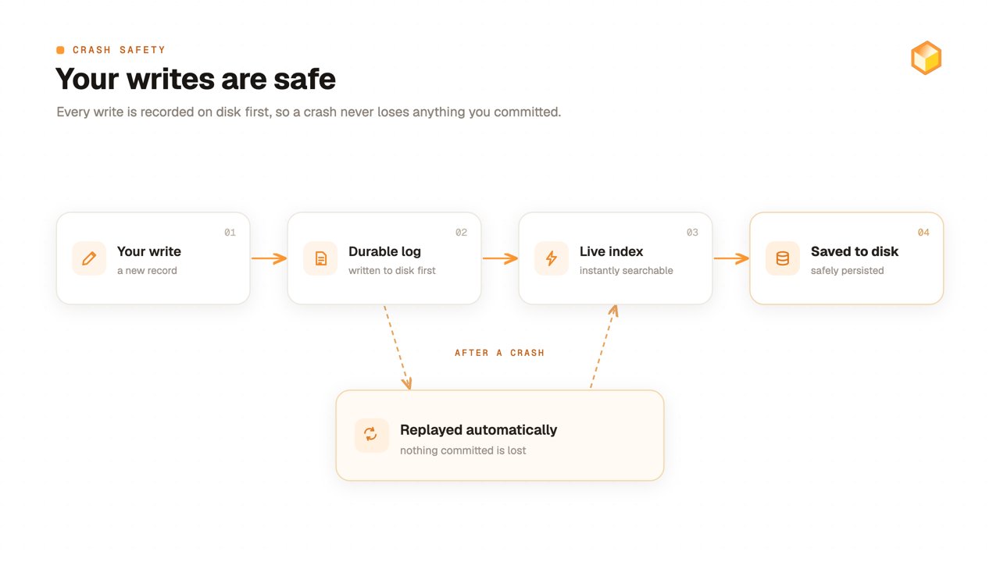
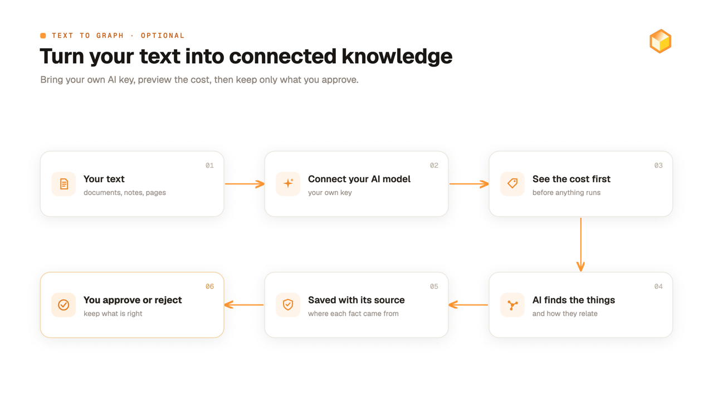
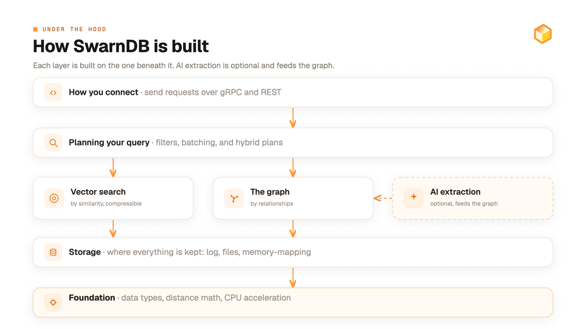

<p align="center">
  
</p>

<p align="center">
  <h1 align="center">SwarnDB</h1>
  <p align="center">
    <strong>The vector database that thinks in graphs.</strong>
  </p>
  <p align="center">
    <a href="LICENSE"></a>
    <a href="https://github.com/SarthiAI/SwarnDB/tags"></a>
    <a href="https://pypi.org/project/swarndb/"></a>
    <a href="https://hub.docker.com/r/sarthiai/swarndb"></a>
  </p>
</p>

---

## One store for meaning and structure

Most teams bolt a vector database to a graph database and then spend their lives keeping the two in sync. Two systems, two copies of the data, two failure modes, and a layer of glue code in between that is always a little out of date.

SwarnDB removes the seam. It is a production-grade engine, written in Rust, where **a vector and a graph node are the same object**: one identity, one storage path, one crash-recovery path. So a single query can move between *what is similar* and *what is connected* without ever leaving the engine.

And if all you want is a fast, accurate vector store, that is exactly what you get out of the box. When you do want the graph, it is a real, typed graph: directed, typed edges that carry confidence and provenance, which you create explicitly or have an LLM extract. It is not a similarity graph inferred from your vectors. It is opt-in, per collection, ready the moment your problem grows past nearest-neighbor.

<p align="center">
  
</p>

---

## The one idea

In SwarnDB, the id of a vector *is* the id of its graph node. There is no foreign key, no mirror table, no eventual consistency between two stores. The thing you searched for and the thing you traverse from are literally the same row. Sharing identity is about the node, not the edges: the edges are explicit and typed, the ones you write with `put_edge` or extract with an LLM, never inferred from similarity.

That single decision is what makes a query like this possible: **scope by structure, then rank by meaning, in one plan.**

```python
from swarndb import SwarnDBClient

with SwarnDBClient(host="localhost", port=50051) as client:
    # mode="hybrid" turns on the first-class typed graph.
    client.collections.create(
        "articles", dimension=384, distance_metric="cosine", mode="hybrid"
    )

    # The id each insert returns is the node's id. Vector and node are one object.
    a = client.vectors.insert("articles", vector=[0.1, 0.2, 0.3, ...], metadata={"topic": "physics"})
    b = client.vectors.insert("articles", vector=[0.3, 0.1, 0.4, ...], metadata={"topic": "math"})
    c = client.vectors.insert("articles", vector=[0.2, 0.4, 0.1, ...], metadata={"topic": "physics"})

    # Typed edges carry provenance, not just a pointer.
    client.graph.put_edge("articles", source=a, target=b, edge_type="CITES",
                          provenance={"doc_id": "paper-1"})
    client.graph.put_edge("articles", source=b, target=c, edge_type="CITES",
                          provenance={"doc_id": "paper-2"})

    # One composable hybrid query:
    # seed by similarity -> walk the graph -> rank the frontier exactly by meaning.
    result = (
        client.graph.query("articles")
        .vector_similar([0.1, 0.2, 0.3, ...], k=20)
        .traverse("CITES", direction="outgoing")
        .vector_rank([0.1, 0.2, 0.3, ...], k=10)
        .return_nodes()
    )
    for node in result.nodes:
        print(node.id, node.label)
```

No second database. No sync job. No copy drift. Just one query that knows both what things mean and how they connect.

---

## What you get

**A fast, accurate vector store: the default, with nothing turned on.**
Every collection is an approximate-nearest-neighbor store backed by HNSW for high-recall in-memory search, with optional SQ8 scalar quantization for a compressed index on larger collections. Four distance metrics (cosine, euclidean, dot, manhattan), per-query `ef_search` to tune recall against latency, batch search, and metadata pre-filtering with adaptive index selection.

**A first-class typed graph in the same engine (opt-in).**
Flip a collection to `mode="hybrid"` and store typed, directed edges that carry confidence, a manual-versus-extracted flag, and a full provenance record. Then run one composable query that chains vector similarity, single-hop and k-hop traversal, shortest path, and a graph-first `vector_rank` that scopes by structure and ranks exactly by meaning.

**Attribute-constrained search that is actually correct.**
`scan_by_filter(predicate=...)` fixes the candidate set first, then `vector_rank(...)` ranks it exactly, so the returned top-k is the *complete, correct* top-k among items that meet the condition. On real public datasets, plain vector search with an attribute condition often returns mostly non-matching items, and on a large share of such queries returns nothing usable at all. Filter-then-search returns the right top-10 every time.

**Optional LLM-driven extraction: bring your own key.**
Point a hybrid collection at any OpenAI-compatible model to turn raw text chunks into typed entities and edges, each with full provenance and a verify / reject / re-extract curation loop. Off by default. You supply and own the key.

**Quality-aware and time-filtered traversal.**
Weight hops by edge confidence, recency, or an explicit numeric property, and restrict a hop to edges valid at a point in time and regime. All opt-in.

**15+ vector math operations, built in.**
Ghost vectors, cone search, SLERP interpolation, k-means, PCA, maximal marginal relevance, centroid computation, analogy completion, drift detection, and more. On a hybrid collection, several of them run exactly over a graph-built frontier.

**Built to survive production.**
Rust-native with SIMD acceleration (AVX2, SSE4.1, NEON, scalar fallback), zero-copy mmap, arena allocators, and lock-free concurrency. Crash-safe by default via write-ahead log, with transparent recovery and fast restart. Dual API: high-throughput gRPC and curl-friendly REST.

> - **macOS Intel (x86_64) is not built by CI.** Apple Silicon Macs only for the macOS wheel today. Intel-Mac users can run the manual release script on an x86_64 macOS host or wait for native support.
> - **Windows ARM64 is not built by CI.** Windows x86_64 only for the Windows wheel today. Windows on ARM hosts can run the x86_64 wheel under Windows' built-in x86 emulation, or wait for native support.

---

## How a hybrid query flows

A hybrid query is a small pipeline. You seed a candidate set by similarity, let the graph reshape it by structure, then rank what survives, all inside one engine, over one copy of the data.

<p align="center">
  
</p>

And because storage is unified, ingestion and recovery are one path too: a write hits the log first, so a crash never costs you committed data.

<p align="center">
  
</p>

---

## Performance

Search throughput, recall, and latency on **DBpedia 1M (1536-dim float32)** with cosine distance and default HNSW parameters (`M=16`, `ef_construction=200`), measured on a **32-core, 64 GB host** with **8 concurrent searcher threads**, 1,000 queries per `ef_search` setting averaged across 3 iterations:

| ef_search | QPS   | Recall@10 | p50 (ms) | p95 (ms) | p99 (ms) |
|-----------|-------|-----------|----------|----------|----------|
| 25        | 2,398 | 0.9816    | 3.16     | 4.91     | 6.06     |
| 50        | 2,214 | 0.9894    | 3.33     | 5.26     | 6.77     |
| 100       | 1,801 | 0.9921    | 4.16     | 6.85     | 8.02     |
| 200       | 1,233 | 0.9935    | 6.18     | 10.19    | 12.26    |
| 400       |   760 | 0.9960    | 10.00    | 16.83    | 20.48    |
| 800       |   437 | 0.9974    | 17.42    | 30.43    | 35.90    |

**~0.99 recall@10 at over 2,200 QPS**, single host. Loading that same 1M set via `bulk_insert_from_path` peaks at **7.45 GiB** resident (the file is memory-mapped, so working memory is bounded by the index, not the input), and a 200k collection comes back queryable **5.5 seconds** after a hard `SIGKILL`.

For worker-saturation curves, ingestion rates, restart and recovery timings, and full reproduction recipes, see [Benchmarks](docs/benchmarks.md).

---

## Quick Start

Pull and run from Docker Hub:

```bash
docker run -d -p 8080:8080 -p 50051:50051 sarthiai/swarndb
```

Install the SDK:

```bash
pip install swarndb
```

Connect, create a plain vector collection, insert a few vectors, and search:

```python
from swarndb import SwarnDBClient

with SwarnDBClient(host="localhost", port=50051) as client:
    # Vector-only by default.
    client.collections.create("articles", dimension=384, distance_metric="cosine")

    # Each insert returns the assigned id.
    client.vectors.insert("articles", vector=[0.1, 0.2, 0.3, ...], metadata={"topic": "physics"})
    client.vectors.insert("articles", vector=[0.3, 0.1, 0.4, ...], metadata={"topic": "math"})

    # Search for the nearest neighbors.
    results = client.search.query("articles", vector=[0.1, 0.2, 0.3, ...], k=10)
    for r in results.results:
        print(r.id, r.score)  # distance score, lower is more similar
```

The same operations are available over REST, and async support is available via `AsyncSwarnDBClient` with the same API surface.

> See the [Docker Guide](docs/docker.md) for persistence, configuration, and Docker Compose, and the [API Reference](docs/api-reference.md) for REST.

---

## Turn text into a graph (optional)

Bring your own OpenAI-compatible key, and SwarnDB will read your text chunks, propose typed entities and edges, and let you preview the cost before a single token is spent, then curate what it found.

<p align="center">
  
</p>

```python
from swarndb import SwarnDBClient

with SwarnDBClient(host="localhost", port=50051) as client:
    client.extraction.set_llm_config(
        "articles",
        base_url="https://openrouter.ai/api/v1",
        api_key="sk-or-...",
        model_name="openai/gpt-4o-mini",
        temperature=0.0,
        max_tokens=2048,
    )
    client.extraction.set_ontology("articles", base_template="research-papers", replace=False)

    estimate = client.extraction.cost_preview("articles", chunks)
    print(f"Estimated cost: ${estimate.estimated_cost_usd}")

    result = client.extraction.start_extraction("articles", chunks)
```

Every auto-generated edge keeps its source document, source chunk, model, confidence, and verification status, so you always know where a fact came from. See [LLM Extraction](docs/llm-extraction.md).

---

## Architecture

SwarnDB is organized as eight Rust crates with clean dependency boundaries:

<p align="center">
  
</p>

| Crate | Role |
|:--|:--|
| `vf-core` | Core types, distance functions, SIMD kernels |
| `vf-storage` | WAL, segment management, memory-mapped I/O, collections |
| `vf-index` | HNSW and brute-force index implementations |
| `vf-query` | Filter evaluation, query execution, batch processing, hybrid vector-and-graph query engine |
| `vf-quantization` | Scalar, product, and binary quantization; IVF partitioning |
| `vf-graph` | First-class typed graph: typed nodes and edges with provenance, traversal, and composable hybrid queries |
| `vf-extraction` | Optional LLM-driven extraction of typed entities and edges from text (bring your own key) |
| `vf-server` | gRPC and REST servers, authentication, health checks |

---

## Key Capabilities

### Ingestion

- **Single insert** for one-at-a-time writes via gRPC or REST
- **Streaming bulk insert** with batched gRPC streams, configurable batch lock size, WAL flush interval, and optional parallel HNSW construction
- **File-based bulk insert** via `bulk_insert_from_path`: the server reads a `.npy` or flat `.f32` file from any path it can read and ingests directly from the kernel page cache, without copying the payload through gRPC
- **Deferred indexing** during bulk loads, finalized by a single `optimize()` call that rebuilds the HNSW index and metadata index, with the virtual graph rebuilt on the same call when `rebuild_graph=true`
- **Bulk insert checkpoints and resume** via per-batch checkpoints and an opaque `resume_token`, so interrupted loads pick up from the last committed batch

### Restart and Recovery

- **Fast restart** for plain HNSW collections, queryable within seconds of the server opening its ports
- **Parallel collection load** at startup, so a multi-collection database comes up in parallel rather than serially
- **Incremental delta replay or full write-ahead log replay** on unclean shutdown, applied transparently before traffic resumes
- **Operational endpoints** for orchestration: `/healthz`, `/readyz`, `/startupz`; a global `/recovery_status`; a per-collection `GET /api/v1/collections/{collection}/persistence_status`; and Prometheus metrics at `/metrics`

### Vector Operations

- **HNSW index** with configurable `ef_construction`, `ef_search`, and `M`
- **Scalar quantization (SQ8)** as the per-collection quantization mode: 8-bit encoding that rescores candidates against full-precision vectors, keeping recall close to plain HNSW, with fast-restart parity
- **IVF + Product Quantization** for billion-scale datasets with bounded memory
- **Batch search** with multi-query execution and shared overhead
- **Pre-filtering** with adaptive index selection (B-tree, hash, bitmap) for metadata-filtered queries
- **Per-query ef_search** to tune the recall/latency tradeoff at query time

### Graph (first-class, hybrid)

Opt in per collection via `mode="hybrid"` at create time. All of the following is off until you do.

- **Typed edges with provenance** linking content and entity nodes, each carrying a type, confidence, a manual-versus-extracted flag, and a provenance record
- **Optional LLM extraction (BYOK)** turning text chunks into typed entities and edges with any OpenAI-compatible model
- **Composable hybrid queries** chaining vector similarity, single-hop traverse, k-hop expansion, shortest path, and a graph-first `vector_rank`
- **Quality-aware and temporal traversal** weighting hops by confidence, recency, or property, and restricting hops to edges valid at a point in time and regime
- **Vector math over a graph-built frontier** so analogy, diversity, cone, and centroid operations run exactly over the candidate set the graph produced
- **Manual edge CRUD and bulk import** with create, read, update, verify, reject, audit history, and CSV/JSONL bulk loading

Separately, an optional virtual graph (automatic similarity edges, not your typed edges) is available as a secondary mode (`mode="auto_similarity"`), off by default. It is a convenience for similarity-only traversal; the first-class typed graph described above is SwarnDB's graph.

### Math Engine

A library of vector math operations available through both gRPC and REST. The core operations:

| Operation | What it does | Where to use it |
|:--|:--|:--|
| Ghost vectors | Synthetic vectors representing absent concepts in a space | Search for something you have no example of yet, like the ideal product that fills a gap in your catalog |
| Cone search | Angular proximity search within a cone aperture | "More like this, but only in this direction," with a tunable strictness dial, for tightly themed search |
| SLERP interpolation | Spherical linear interpolation between vectors | Blend two preferences into a smooth in-between, such as a style halfway between two products |
| Centroid computation | Weighted and unweighted centroids of vector sets | Roll many items into one profile, like a customer's overall taste from their history or a topic's signature |
| Vector drift detection | Track how vector representations change over time | Catch when meaning shifts, a user's interests moving, content going off-topic, or an embedding model going stale |
| K-means clustering | Partition vectors into k clusters | Group items into natural buckets for customer segmentation, content topics, or catalog organization |
| PCA | Dimensionality reduction via principal component analysis | Shrink vectors for faster search and smaller storage, or project to 2D for maps and dashboards |
| Analogy completion | Vector arithmetic for analogy tasks (A:B :: C:?) | "This is to that as X is to ?" for relationship-based recommendations and attribute reasoning |
| Maximal marginal relevance | Diversity-aware result re-ranking | Keep results relevant but varied so you never show ten near-duplicates, and to pick broad context for RAG |
| Vector normalization | L2 normalization for angular similarity | The prep step that makes similarity fair, comparing by direction of meaning rather than vector length |

On a hybrid collection, several of these also run as graph-first ranking steps (analogy, diversity, cone, isolation, centroid, interpolation), operating exactly over the candidate set a graph query has already produced, which is where the count climbs past fifteen.

### SIMD Acceleration

All distance computations are SIMD-accelerated with runtime dispatch:

| Instruction Set | Platform | Width |
|:--|:--|:--|
| **AVX2** | x86_64 | 256-bit |
| **SSE4.1** | x86_64 | 128-bit |
| **NEON** | ARM / Apple Silicon | 128-bit |
| **Scalar** | All platforms | Portable fallback |

Specialized kernels include fused cosine distance (dot product plus norms in a single pass), batched multi-vector distance computation, and SIMD gather for PQ distance-table lookups.

---

## Configuration

All configuration is via environment variables. See `.env.example` for the full list.

| Variable | Default | Description |
|:--|:--|:--|
| `SWARNDB_HOST` | `0.0.0.0` | Bind address |
| `SWARNDB_GRPC_PORT` | `50051` | gRPC listener port |
| `SWARNDB_REST_PORT` | `8080` | REST listener port |
| `SWARNDB_DATA_DIR` | `./data` | Data storage directory |
| `SWARNDB_LOG_LEVEL` | `info` | Log verbosity (`trace`, `debug`, `info`, `warn`, `error`) |
| `SWARNDB_API_KEYS` | *(empty)* | Comma-separated API keys; empty disables auth |
| `SWARNDB_MAX_CONNECTIONS` | `1000` | Maximum concurrent connections |
| `SWARNDB_REQUEST_TIMEOUT_MS` | `10000` | Request timeout in milliseconds |

---

## API Reference

SwarnDB exposes dual API surfaces: **gRPC** on port `50051` and **REST** on port `8080`.

| Operation | gRPC Service | REST Endpoint |
|:--|:--|:--|
| Collection CRUD | `CollectionService` | `POST/GET/DELETE /api/v1/collections` |
| Vector CRUD | `VectorService` | `POST/GET/DELETE /api/v1/collections/{id}/vectors` |
| Search | `SearchService` | `POST /api/v1/collections/{id}/search` |
| Batch search | `SearchService` | `POST /api/v1/search/batch` |
| Graph operations | `GraphService` | `POST/GET /api/v1/collections/{id}/graph/*` |
| Math operations | `MathService` | `POST /api/v1/collections/{id}/math/*` |
| Health / Readiness | `HealthService` | `GET /health`, `GET /ready` |

For complete API documentation, see [API Reference](docs/api-reference.md).

---

## Documentation

**Get started**

| Guide | Description |
|:--|:--|
| [Getting Started](docs/getting-started.md) | Installation, first steps, basic usage |
| [Core Concepts](docs/core-concepts.md) | Collections, vectors, metadata, indexing, collection modes |

**Vector search**

| Guide | Description |
|:--|:--|
| [Quantization](docs/quantization.md) | SQ8 and other quantization modes, when to choose each, how to enable them |
| [Vector Math](docs/vector-math.md) | All 15+ vector math operations with examples |

**The graph**

| Guide | Description |
|:--|:--|
| [Typed Graph: Overview](docs/graph-first-class.md) | What the typed graph is and which graph to use (start here) |
| [Typed Graph: Complete Guide](docs/graph-guide.md) | The full how-to reference: typed node and edge CRUD, all hybrid-query steps, predicates, curation |
| [LLM Extraction](docs/llm-extraction.md) | Optional LLM-driven extraction of typed entities and edges from text, bring your own key |
| [Virtual Graph](docs/virtual-graph.md) | The virtual graph (the automatic similarity graph): concepts, traversal, thresholds |

**Ingestion and operations**

| Guide | Description |
|:--|:--|
| [Bulk Ingestion](docs/bulk-ingestion.md) | Insert modes, optimize(), large file-based loads via bulk_insert_from_path |
| [Configuration](docs/configuration.md) | Environment variables and tuning guide |
| [Docker Guide](docs/docker.md) | Docker setup, persistence, Compose, and building from source |
| [Deployment](docs/deployment.md) | Docker, Kubernetes, and Helm deployment |
| [Benchmarks](docs/benchmarks.md) | Reference workloads, hardware, measured numbers, reproduction recipes |
| [Known Issues](docs/known-issues.md) | Current limitations and their recommended mitigations |

**API and SDK**

| Guide | Description |
|:--|:--|
| [API Reference](docs/api-reference.md) | Complete gRPC and REST API documentation |
| [Python SDK](docs/python-sdk.md) | SDK installation, client usage, async support |

---

## Issues and Feedback

Found a bug or have a feature request? Open an issue on [GitHub Issues](https://github.com/SarthiAI/SwarnDB/issues).

---

## License

[Elastic License 2.0 (ELv2)](LICENSE) Source-available. You are free to use, embed, modify, and redistribute SwarnDB for any purpose, including commercial use inside your products. You may not offer SwarnDB itself as a hosted or managed service that substitutes for the features of this software, and you may not remove or obscure the license notices.

In plain language: build on top of SwarnDB, ship it inside your products, modify it for your own use. Do not repackage it and sell it as "MyVectorDBSolution."

---

The SwarnDB project is envisioned, developed and maintained by <a href="https://www.linkedin.com/in/chirotpal/" target="_blank">Chirotpal</a>
