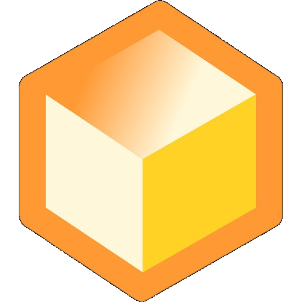

<p align="center">
  
</p>

<h1 align="center">SwarnDB</h1>

<p align="center">
  <em>The vector database that thinks in graphs.</em>
</p>

<p align="center">
  <a href="LICENSE"></a>
  <a href="https://hub.docker.com/r/swarndb/swarndb"></a>
  <a href="https://www.rust-lang.org"></a>
  <a href="https://github.com/YOUR_ORG/swarndb/releases"></a>
</p>

<p align="center">
SwarnDB is a Rust-native vector database that fuses similarity search, graph relationships, and vector geometry into a single engine. No garbage collector. No JVM. No cluster required. Billion-scale vector search on a single node, with a built-in graph layer that makes every vector aware of its neighbors.
</p>

---

## Why SwarnDB

### Rust-Native Performance

Zero-GC, zero-copy architecture built from the ground up in Rust. Distance computations are SIMD-accelerated with fused cosine kernels, batched AVX2/NEON pipelines, and runtime dispatch. The indexing stack (IVF + HNSW + PQ) is designed to push billion-scale search on a single machine.

- **Tiered storage**: hot vectors in RAM, warm vectors via mmap, cold vectors on disk
- **Lock-free concurrency**: DashMap-backed stores, per-node HNSW locking, adaptive concurrency control
- **Arena allocation**: contiguous memory layout for cache-friendly graph traversal
- **Benchmark**: 1,500+ QPS at 0.99 recall on 1M vectors (1536 dimensions)

### Vectors That Know Their Neighbors

Most vector databases treat vectors as isolated points. SwarnDB builds a virtual graph at insert time, automatically connecting vectors that exceed a configurable similarity threshold. No separate graph database. No ETL pipeline. Just vectors that understand their relationships.

- **Multi-hop traversal**: walk the graph 1, 2, or N hops deep for RAG, knowledge graphs, and recommendations
- **Configurable thresholds**: set similarity cutoffs per collection, per query, or per vector
- **Graph-amplified search**: combine ANN results with graph neighbors for 5.6x speedup over flat search
- **Relationship propagation**: edges propagate through the graph as new vectors arrive

### A Geometry Engine, Not Just Storage

SwarnDB treats vectors as mathematical objects, not blobs. A full suite of vector math operations ships as first-class API endpoints.

- **Cone search**: find vectors within angular bounds of a direction
- **Ghost patterns**: reason about hypothetical vectors without storing them
- **SLERP interpolation**: smooth spherical transitions between vectors
- **Drift detection**: track how vector representations shift over time
- **K-means clustering**: partition vector spaces server-side
- **PCA dimensionality reduction**: reduce dimensions without a separate ML pipeline
- **Analogy search**: king - man + woman = queen, natively
- **MMR diversity sampling**: maximal marginal relevance for diverse result sets

---

## Quickstart

Get SwarnDB running in 30 seconds.

```bash
git clone https://github.com/YOUR_ORG/swarndb.git
cd swarndb
docker compose up -d
```

Install the Python SDK:

```bash
pip install swarndb
```

Connect and search:

```python
from swarndb import SwarnDBClient
import numpy as np

client = SwarnDBClient("localhost:50051")

# Create a collection
client.create_collection("documents", dimension=384)

# Insert vectors
vectors = np.random.rand(100, 384).astype(np.float32)
ids = [f"doc_{i}" for i in range(100)]
client.upsert("documents", ids=ids, vectors=vectors)

# Search
query = np.random.rand(384).astype(np.float32)
results = client.search("documents", query, top_k=5)

# Traverse the graph
neighbors = client.graph_search("documents", start_id="doc_0", depth=2)
```

---

## Features

### Search
| Feature | Description |
|---|---|
| HNSW | Hierarchical navigable small world graphs with tunable ef_search |
| IVF + HNSW + PQ | Hybrid index for billion-scale search on a single node |
| Pre-filtering | Filters applied **before** search, not after (no wasted computation) |
| Batch search | Execute multiple queries in a single round-trip |
| Per-query ef_search | Tune accuracy vs. speed on every individual query |

### Graph
| Feature | Description |
|---|---|
| Virtual graph | Automatic relationship graphs built at insert time |
| Multi-hop traversal | Walk 1 to N hops through the similarity graph |
| Relationship propagation | New vectors inherit edges as the graph grows |
| Configurable thresholds | Per-collection, per-query, and per-vector similarity cutoffs |
| Graph-enriched search | ANN results automatically expanded with graph neighbors |

### Vector Math
| Feature | Description |
|---|---|
| Cone search | Directional similarity within angular bounds |
| Ghost patterns | Hypothetical vector reasoning without persistence |
| SLERP | Spherical linear interpolation between vectors |
| Drift detection | Track vector representation changes over time |
| K-means clustering | Server-side vector space partitioning |
| PCA | Dimensionality reduction as an API call |
| Analogy search | Vector arithmetic (A - B + C = ?) |
| MMR | Maximal marginal relevance for diverse results |

### Storage
| Feature | Description |
|---|---|
| WAL persistence | Write-ahead log with configurable flush intervals |
| mmap support | Memory-mapped access for warm-tier vectors |
| Tiered storage | Hot (RAM), warm (mmap), cold (disk) |
| Backup and restore | Full collection snapshots |
| Auto-compaction | Background compaction with fragmentation tracking |

### Quantization
| Feature | Description |
|---|---|
| Scalar (SQ) | 32-bit to 8-bit scalar quantization |
| Product (PQ) | Sub-vector product quantization with SIMD gather |
| Binary (BQ) | 1-bit binary quantization for maximum compression |

### APIs and SDKs
| Feature | Description |
|---|---|
| gRPC | High-performance binary protocol on port 50051 |
| REST | JSON API on port 8080 |
| Python SDK | Sync and async clients with NumPy integration |

### Production
| Feature | Description |
|---|---|
| Prometheus metrics | Built-in `/metrics` endpoint |
| Structured logging | JSON log output with configurable levels |
| Health checks | Liveness and readiness probes |
| Graceful shutdown | Clean connection draining on SIGTERM |
| Docker | Official image with multi-stage build |
| Kubernetes | Manifests and Helm charts included |

---

## Comparison

| Feature | SwarnDB | Pinecone | Milvus | Qdrant | Weaviate | ChromaDB |
|---|:---:|:---:|:---:|:---:|:---:|:---:|
| Virtual graph relationships | Yes | No | No | No | No | No |
| Vector math APIs (cone, ghost, SLERP, analogy, MMR) | Yes | No | No | No | No | No |
| Built-in graph traversal | Yes | No | No | No | No | No |
| Pre-filtering | Yes | Yes | Yes | Yes | Yes | Partial |
| Billion-scale, single node | Yes | No | Cluster | mmap | No | No |
| Rust-native | Yes | No | No | Yes | No | No |
| Open source | Yes | No | Yes | Yes | Yes | Yes |

SwarnDB is the only vector database that combines similarity search, graph traversal, and vector geometry in a single engine. Others require bolting on a separate graph database or external compute pipelines.

---

## Architecture

SwarnDB is a modular Rust workspace organized into seven crates, each with a single responsibility.

```
swarndb/
  crates/
    vf-core         Vector types, distance functions (cosine, euclidean, dot), SIMD kernels
    vf-storage       WAL, segments, mmap, tiered storage, backup/restore, recovery
    vf-index         HNSW indexing, parallel build, arena allocation, flat adjacency lists
    vf-query         Query execution, pre-filtering, adaptive oversampling, batch search
    vf-quantization  Scalar (SQ), Product (PQ), Binary (BQ) quantization, IVF partitioning
    vf-graph         Virtual graph relationships, traversal, propagation, threshold management
    vf-server        gRPC + REST API server, auth, metrics, health checks, rate limiting
```

**Tiered storage model**: vectors are classified by access frequency. Hot vectors live in RAM for sub-millisecond access. Warm vectors are memory-mapped for efficient paging. Cold vectors reside on disk and are loaded on demand. The engine manages promotion and demotion automatically.

---

## Python SDK

Install from PyPI:

```bash
pip install swarndb
```

The SDK provides both synchronous and asynchronous clients with full NumPy integration. Requires Python 3.9+.

**Async example:**

```python
import asyncio
import numpy as np
from swarndb import AsyncSwarnDBClient

async def main():
    client = AsyncSwarnDBClient("localhost:50051")

    await client.create_collection("embeddings", dimension=1536)

    vectors = np.random.rand(1000, 1536).astype(np.float32)
    ids = [f"vec_{i}" for i in range(1000)]
    await client.upsert("embeddings", ids=ids, vectors=vectors)

    query = np.random.rand(1536).astype(np.float32)
    results = await client.search("embeddings", query, top_k=10)

    for r in results:
        print(f"{r.id}: {r.score:.4f}")

asyncio.run(main())
```

---

## Configuration

SwarnDB is configured entirely through environment variables. Copy `.env.example` to `.env` and adjust as needed.

| Variable | Default | Description |
|---|---|---|
| `SWARNDB_GRPC_PORT` | `50051` | gRPC API port |
| `SWARNDB_REST_PORT` | `8080` | REST API port |
| `SWARNDB_DATA_DIR` | `/data` | Persistent storage directory |
| `SWARNDB_LOG_LEVEL` | `info` | Log level (trace, debug, info, warn, error) |
| `SWARNDB_API_KEYS` | *(empty)* | Comma-separated API keys; empty disables auth |
| `SWARNDB_MAX_CONNECTIONS` | `64` | Maximum concurrent connections |

See [`.env.example`](.env.example) for the full list of tunable parameters, including HNSW construction settings, WAL flush intervals, and timeout controls.

---

## Benchmarks

**DBPedia 1M (1536-dim, OpenAI embeddings)**

| Metric | Result |
|---|---|
| Peak QPS | 1,562 |
| Recall@10 | 0.99 |
| Graph amplification | 5.6x speedup via multi-hop traversal |

Benchmarks run on a single node. No clusters, no sharding. Full benchmark suite and reproduction scripts are available in the [`benchmark/`](benchmark/) directory.

---

## Deployment

**Docker Compose** (recommended for getting started):

```bash
docker compose up -d
```

**Benchmark profile** (higher resource allocation for heavy workloads):

```bash
docker compose --profile benchmark up -d
```

**Kubernetes**: manifests are available in [`k8s/`](k8s/) for direct deployment.

**Helm**: charts are available in [`helm/`](helm/) for templated deployments.

**Container image**: `ghcr.io/YOUR_ORG/swarndb`

---

## License

SwarnDB is licensed under the [Elastic License 2.0 (ELv2)](LICENSE). You are free to use, modify, and distribute SwarnDB, but you may not offer it as a managed service to third parties.

---

<p align="center">
  This project is designed, developed & maintained by <a href="">Chirotpal Das</a>
</p>
